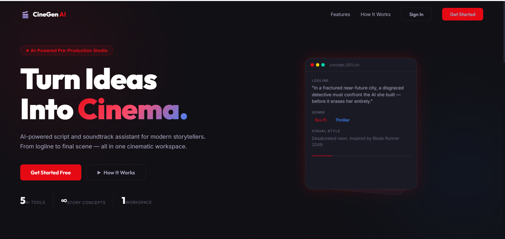
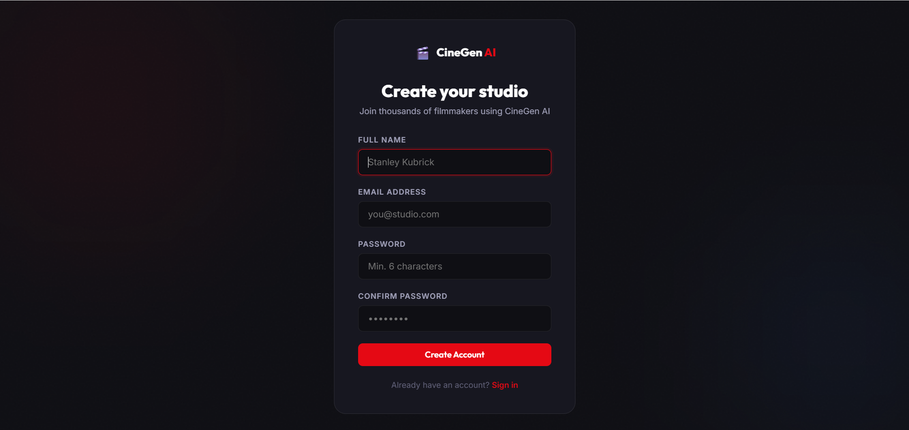
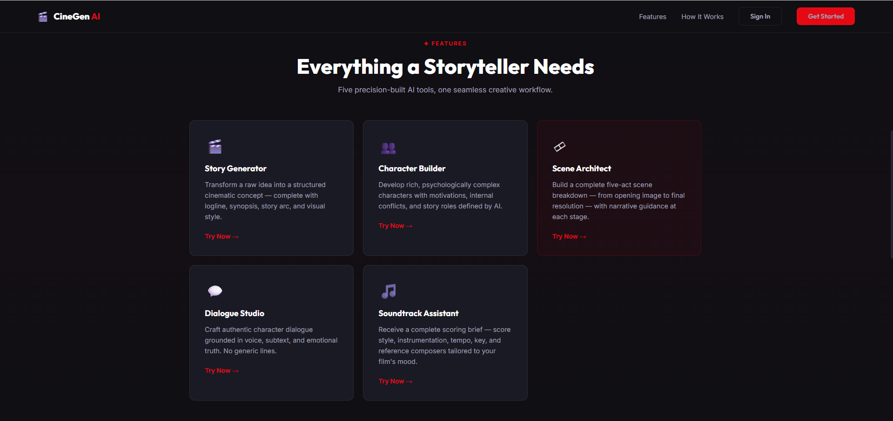
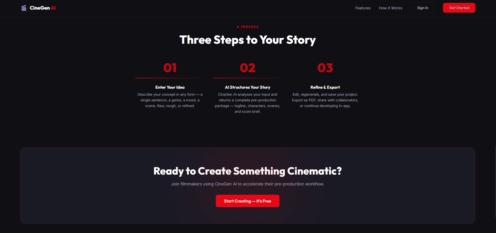

# CineGen AI

🎬 **Turn Ideas Into Cinema** — An AI-powered script and soundtrack assistant for modern storytellers and filmmakers.

## Overview

CineGen AI is a comprehensive web application that helps writers, directors, and filmmakers create compelling scripts and original soundtracks using artificial intelligence. Built with Flask and Firebase, it provides an intuitive interface for story development, character creation, scene building, and music composition.

## Features

- **📝 Script Writing**: AI-assisted script creation with genre-specific templates
- **🎭 Character Development**: Build detailed character profiles with AI-generated backstories
- **🎬 Scene Builder**: Construct scenes with visual descriptions and dialogue
- **🎵 Soundtrack Composer**: Generate original music scores for your projects
- **👥 User Authentication**: Secure Firebase-based authentication system
- **📊 Dashboard**: Track your creative progress and project statistics
- **⚙️ Admin Panel**: Administrative tools for managing users and content
- **📱 Responsive Design**: Works seamlessly on desktop and mobile devices

## Tech Stack

- **Backend**: Python Flask
- **Frontend**: HTML5, CSS3, JavaScript
- **Database**: Firebase Firestore
- **Authentication**: Firebase Auth
- **Deployment**: Ready for cloud platforms (Heroku, AWS, etc.)

## Prerequisites

- Python 3.8 or higher
- Firebase project with Firestore enabled
- Google Cloud service account key (for Firebase Admin SDK)

## Screenshots

### Landing Page


### Signup Page


### Features Section


### How It Works



## Installation

1. **Clone the repository:**
   ```bash
   git clone https://github.com/yourusername/cinegen-ai.git
   cd cinegen-ai
   ```

2. **Create a virtual environment:**
   ```bash
   python -m venv venv
   source venv/bin/activate  # On Windows: venv\Scripts\activate
   ```

3. **Install dependencies:**
   ```bash
   pip install -r requirements.txt
   ```

4. **Set up Firebase:**
   - Create a Firebase project at [https://console.firebase.google.com/](https://console.firebase.google.com/)
   - Enable Firestore Database
   - Enable Authentication with Email/Password provider
   - Download your service account key JSON file

5. **Configure environment variables:**
   Create a `.env` file in the root directory:
   ```env
   FLASK_SECRET_KEY=your-secret-key-here
   GOOGLE_APPLICATION_CREDENTIALS=path/to/your/service-account-key.json
   ```

6. **Run the application:**
   ```bash
   flask run
   ```

   Or for development:
   ```bash
   export FLASK_ENV=development
   flask run
   ```

The application will be available at `http://localhost:5000`

## Usage

1. **Sign Up/Login**: Create an account or sign in with your existing credentials
2. **Dashboard**: View your project statistics and recent activity
3. **Create Story**: Start a new script project by selecting a genre and providing initial concepts
4. **Build Characters**: Develop detailed character profiles with AI assistance
5. **Scene Builder**: Construct individual scenes with descriptions, dialogue, and actions
6. **Soundtrack**: Generate original music scores for your scenes
7. **Export**: Download your completed scripts and audio files

## Project Structure

```
cinegen-ai/
├── app.py                 # Main Flask application
├── firebase_config.py     # Firebase configuration and initialization
├── requirements.txt       # Python dependencies
├── static/               # Static assets (CSS, JS, images)
│   ├── css/
│   └── js/
├── templates/            # Jinja2 HTML templates
│   ├── base.html
│   ├── app_layout.html
│   ├── dashboard.html
│   ├── create_story.html
│   └── ...
└── __pycache__/          # Python bytecode cache
```

## API Endpoints

- `GET /` - Landing page
- `GET /login` - User login page
- `GET /register` - User registration page
- `GET /dashboard` - User dashboard
- `POST /api/auth/session` - Create user session
- `GET /create-story` - Story creation interface
- `GET /characters` - Character management
- `GET /scene-builder` - Scene building tool
- `GET /soundtrack` - Music composition interface

## Contributing

1. Fork the repository
2. Create a feature branch (`git checkout -b feature/amazing-feature`)
3. Commit your changes (`git commit -m 'Add some amazing feature'`)
4. Push to the branch (`git push origin feature/amazing-feature`)
5. Open a Pull Request

## License

This project is licensed under the MIT License - see the [LICENSE](LICENSE) file for details.

## Support

For support, email support@cinegen.ai or join our Discord community.

---

**Made with ❤️ for filmmakers, by filmmakers.**</content>
<filePath">d:\PROJECTS\MAIN_PROJECT\CineGen AI\README.md
